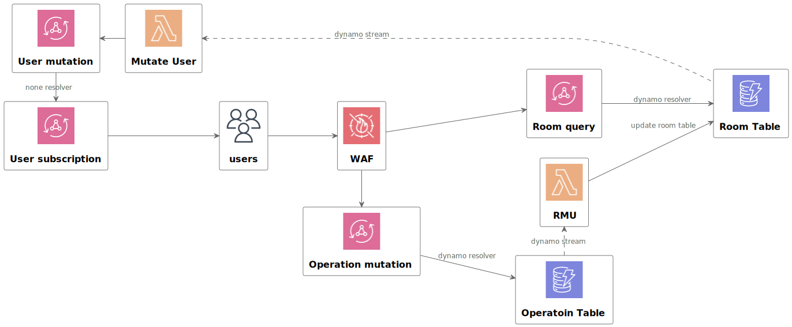

# Salon

Salonはログイン不要の無料Webプランニングポーカーサービスです

## Getting Started
本リポジトリは yarn workspaces を使ってmonorepoで管理しています

### プロジェクト全体でinstall実行
```sh
yarn install
```


### backendをAWSへデプロイ
```sh
yarn workspace salon-backend cdk bootstrap
```

```sh
yarn workspace salon-backend cdk deploy
```

### frontendをローカル起動
```sh
yarn workspace salon-frontend dev
```

## Documents
### ADR
- https://github.com/yuizho/salon/issues/1

### Product
- WIP

### Archtecture



### Database
- [Amazon DynamoDBのテーブル設計](doc/database/database_spec.md)

## Thanks
- [Hero Patterns](https://heropatterns.com/)

## License
MIT
