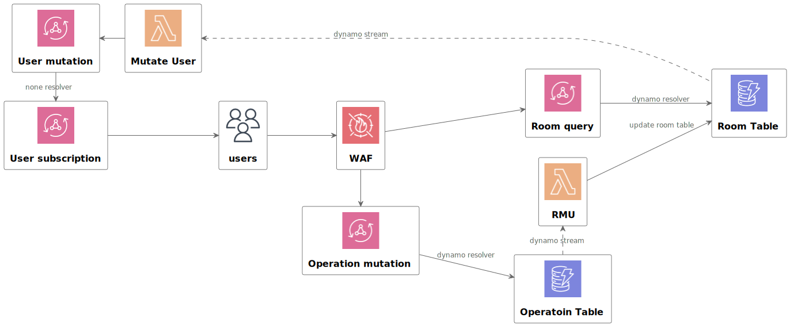

# Archtecture
## 運用するうえで避けたいこと
- ユーザがいないにもかかわらずお金だけすごくかかること
- プロダクトの要件としてログイン不要で使えるものにしたいが、無限に部屋が作られ続けるみたいな自体は避けたい
- ユーザが急に増えた場合でもある程度スケールするようにしておきたい

## Backendの設計

- サーバレスなアーキテクチャを採用して、使われた分だけ費用がかかり、柔軟にスケールできるようにする
- DoS攻撃とかの対策にAppSyncの前にWAFをかます
- リアルタイムでユーザに情報をpushしていく感じのアプリになるので、書き込みの整合性の担保より、データストアの書き込み時のスケーラビリティが重要になる。そのためRDBは使わずにNoSQLを採用する。
- 責任範囲を明確にしてユーザへのpush処理もシンプルに実装したいので、EventSoursing + CQRS採用する
  - そこまでレイテンシをシビアに管理しなくても大丈夫なので、お手軽さをとってDynamoDB StreamとLambdaで実装する
  - https://zenn.dev/j5ik2o/articles/368e0ab78f105f2a0fae
- ユーザへのpush処理の実装の容易さから、フロントエンドとの通信はGraphQLを採用する (ほんで、サーバレスで行きたいのでAppSyncで)

## Frontendの技術選定
Frontend周りは自分が使いやすいやつとか趣味とかで決めてる

- TypeScript
- Next.js
  - CSR中心なのでReactでもいいんだけど、色々最適化が効くことやRouter周りで迷わなくても良くなったりするのでNext.jsを採用
- Tailwind CSS
  - これは趣味
- Amplify
  - GraphQLのクライアントとして使ってみてる
  - Backend側でAppSync使ってるから以上の理由はあんまりないので、これは後で見直すかもしれない
  - Amplifyの機能でGraphQLのスキーマからTSのコードを自動生成してる
