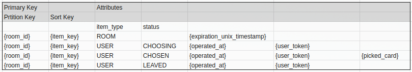

# DynamoDB のテーブル設計

参考: https://speakerdeck.com/_kensh/dynamodb-design-practice

## Usecase List

| Entity    | Type    | UseCase           | conditions                                                                    |
| --------- | ------- | ----------------- | ----------------------------------------------------------------------------- |
| Operation | put     | openRoom          |                                                                               |
| Operation | put     | join              |                                                                               |
| Operation | put     | leave             |                                                                               |
| Operation | put     | pick              |                                                                               |
| Operation | put     | refreshPokerTable |                                                                               |
| Operation | put     | Kick              |                                                                               |
| Room      | query   | getRoom           | room_id = room_id                                                             |
| Room      | put     | openRoom          |                                                                               |
| Room      | put     | join              |                                                                               |
| Room      | update  | leave             | room_id = room_id, item_key = user_id, status <> 'LEAVED', item_type = 'USER' |
| Room      | update  | pick              | room_id = room_id, item_key = user_id, status <> 'LEAVED', item_type = 'USER' |
| Room      | update  | refreshPokerTable | room_id = room_id, item_key = user_id, status <> 'LEAVED', item_type = 'USER' |
| Room      | update  | Kick              | room_id = room_id, item_key = user_id, status <> 'LEAVED', item_type = 'USER' |
| Room      | query   | getActiveUsers    | room_id = room_id, status <> 'LEAVED', item_type = 'USER'                     |
| Room      | query   | existRoom         | room_id = room_id, item_type = 'ROOM'                                         |
| Room      | getItem | getUser           | room_id = room_id, item_key = user_id                                         |

## Table Definition & Stored Data Image

### Operation

- CQRS の command 側のイベントがひたすら insert され、参照とかは基本されないテーブル
  - 将来的に OLAP 処理とかでどこかにデータ転送したりはするかも

### Room

- CQRS の query 側のテーブルなので、command 操作に応じて更新されたり、ユーザ側から参照されたりする
- ulid で発行される room_id を partition キーにしているが、一つの部屋の人数は 10 人とかそんなもんなので Hot key が起きる心配とかも特にないと考えている
  - room_id は ulid で発行するので偏りとかも出ないはず
  - https://docs.aws.amazon.com/ja_jp/amazondynamodb/latest/developerguide/bp-partition-key-design.html#bp-partition-key-partitions-adaptive-boost
  - クエリも基本 room_id 単位になるので、グローバルセカンダリインデックスとかも不要
- expiration_unix_timestamp のフィールドで ttl を設定する
  - これによって一定時間後にデータが消え、部屋は勝手にクローズされる
  - なのであとでデータ調査するときとかは operation 側を調べに行く(あちらはずっと残る)
- 部屋の情報とユーザの情報はテーブルを分けることも考えたが、整合性を保ったりしていくの考えると一つのテーブルで管理したほうがあとで面倒が起きにくいと考えて分けていない
  - このあたりはよく語られるベストプラクティスとも一致した形になった
  - https://marcy.hatenablog.com/entry/2018/08/01/235642
