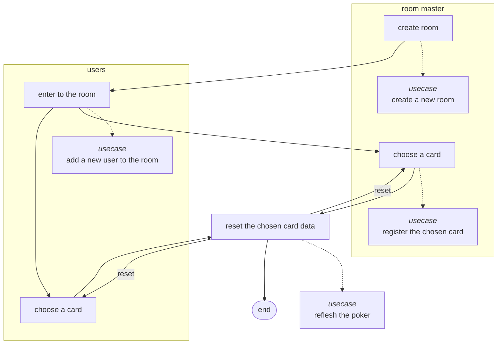
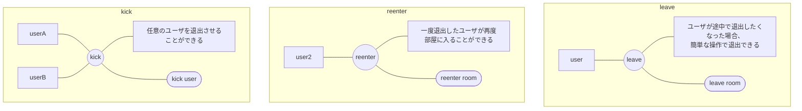
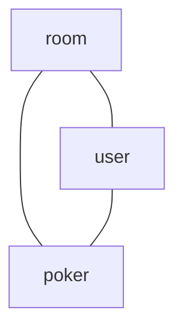
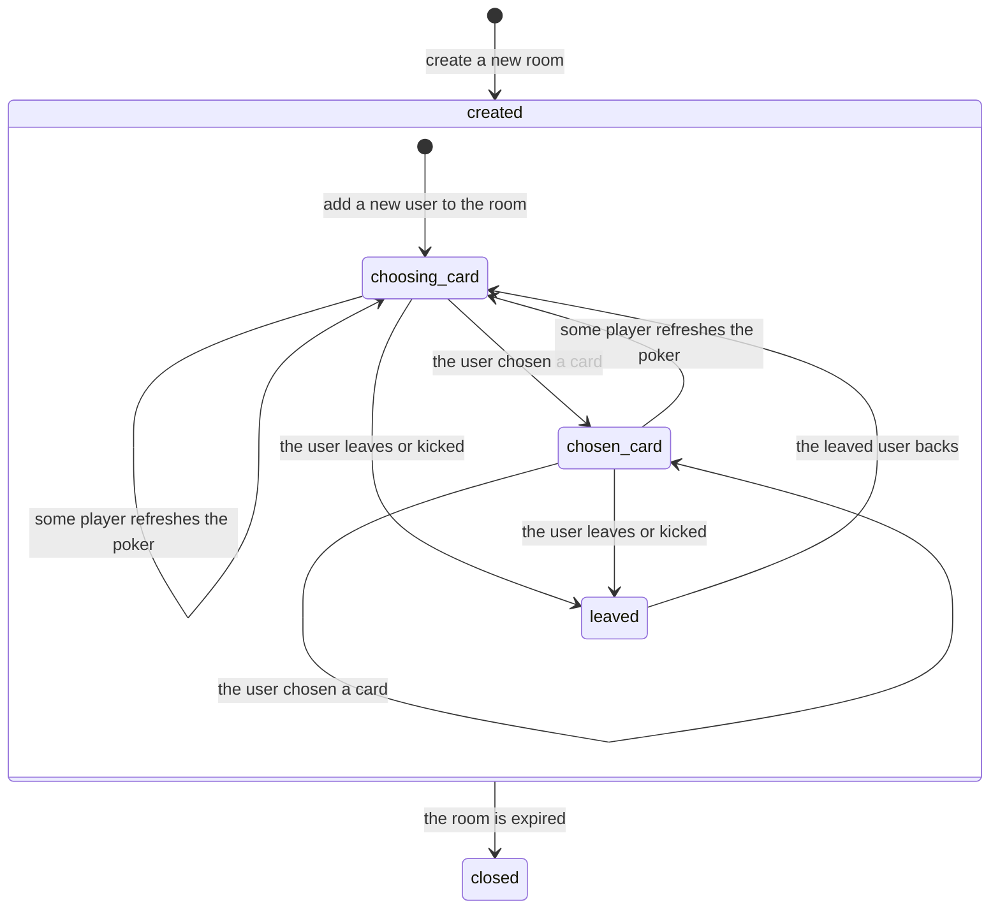

# RDRA(プロダクト要件整理)
## システム価値
```mermaid
flowchart LR
    master[user(room master)] --- salon((salon))
    user[user] --- salon
    
    salon --- note[<b>salonの目的</b><br/>---<br/>業務などでプランニングポーカーによる見積もりを<br/>行いたい人たちに対し、ユーザ登録やログインなどの手間なしで、<br/>プランニングポーカーを実施するための環境を提供する。]
```

- 基本的にユーザはチャットツールやビデオ会議通話と併用して本システムを使うことを想定している
- とにかくシンプルな手順でプランニングポーカーが初められることを重視する

## システム外部環境
### 業務フロー


### 利用シーン


## システム
### 情報モデル


### 状態モデル

